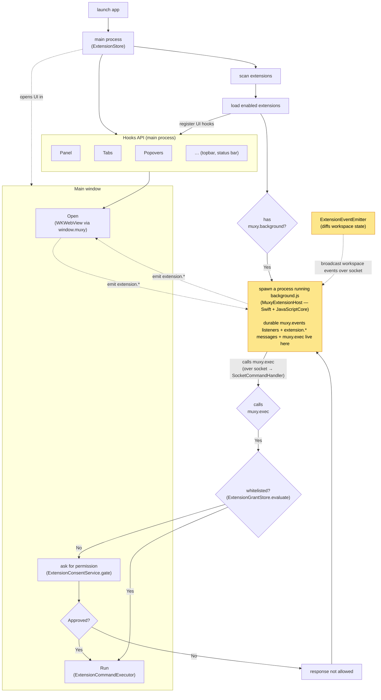

# Extensions

> **Status:** under active development. Marked **DEV** in **Settings → Extensions**. The manifest format, permission set, and wire format may change without notice.

> **New here?** Start with [Get started](get-started.md) — build and run your first extension in about two minutes.

User-installed directories that Muxy loads and runs. Each extension is an npm + [Vite](https://vitejs.dev) project: authors use any framework (React, Vue, Svelte, vanilla), `npm run build` bundles it into a `dist/` directory, and that build output is what gets published and installed. Extensions can react to workspace events, coordinate webviews with a background script, register palette commands, post notifications, and (with permission) drive the same verbs the `muxy` CLI exposes. Most need no background script; Muxy keeps a long-lived background process only for extensions that declare one to receive pushed events, handle extension-local messages, or run background shell commands.

## Architecture

On launch, the main process (`ExtensionStore`) scans `~/.config/muxy/extensions/` (each entry the installed `dist/` of an extension, with its `package.json`), loads the enabled ones, and splits each into two independent surfaces:

- **Hooks API (main process).** Declared UI — panels, tabs, popovers, topbar/status-bar items — is registered in-process and rendered in the main window as `WKWebView`s. Their JS talks to Muxy through the injected `window.muxy` bridge (`ExtensionBridgeHandler` → `MuxyAPIDispatcher`); **no subprocess and no socket are involved**.
- **Background script (subprocess).** If the extension declares a `muxy.background` script, `ExtensionStore.startExtension` spawns `MuxyExtensionHost` — a tiny bundled Swift + JavaScriptCore binary — to run `background.js`. It is where durable **`muxy.events.subscribe` listeners live**, where webviews can send `extension.*` events, where `muxy.exec` is called, and where `muxy.tabs.open` can show results in the active workspace. The host connects back to the main process over the Unix socket (`NotificationSocketServer`).

Workspace events are produced in the main process by `ExtensionEventEmitter` (it diffs workspace state on each change) and broadcast to subscribed host sessions over the socket; the host dispatches them to the `muxy.events` listeners in `background.js`. Extension-local `extension.*` events are scoped to one extension and move between its webviews and its background script through the same main-process broker. A `muxy.exec` call travels the socket to `SocketCommandHandler`, which gates it: `ExtensionGrantStore.evaluate` checks for a remembered (whitelisted) rule; if none, `ExtensionConsentService.gate` prompts in the main window; on approval `ExtensionCommandExecutor` runs the command and the result is returned to `background.js`.



> **Socket scope:** the Unix socket carries traffic between the main window and the **background.js** host (workspace events and `extension.*` events out, `muxy.exec` in). The Hooks API UIs talk to the main process over the WebKit bridge; when they emit `extension.*`, the main process forwards only to that extension's authenticated background host.

## Pages

### Start here

| Page | What's in it |
| --- | --- |
| [Get started](get-started.md) | Build and run your first extension in ~2 minutes |
| [Overview](overview.md) | Architecture, lifecycle, security model |
| [Manifest](manifest.md) | `package.json` `muxy` fields, validation, background script environment |
| [Permissions](permissions.md) | What each permission grants, what isn't gated |

### Build UI

| Page | What's in it |
| --- | --- |
| [Tabs](tabs.md) | Register webview tab types and the injected `window.muxy` JS API |
| [Panels](panels.md) | Register dockable/floating webview panels and the placement rules |
| [Popovers](popovers.md) | Anchor a transient webview popover to a topbar/status bar item |
| [Topbar](topbar.md) | Attach icons to the tab strip that trigger a command |
| [Status Bar](statusbar.md) | Attach icons to the footer status bar; update text live |
| [Modal](modal.md) | Present a native searchable picker; resolves with the selected item |
| [Dialogs](dialogs.md) | Present native confirm/alert sheets on the main window |
| [Palette Commands](palette-commands.md) | Register commands and react to triggers |
| [Scripts](scripts.md) | Run JS files as palette commands in a per-extension JSContext |
| [Lifecycle](lifecycle.md) | Intercept and prevent tab/panel/popover closes (e.g. unsaved changes) |

### Work with the workspace

| Page | What's in it |
| --- | --- |
| [Events](events.md) | Identify/subscribe handshake, event list, wire format |
| [Git](git.md) | Repository access: status, diff, log, branches, PRs, worktrees |
| [Files](files.md) | Workspace filesystem access: list, read, stat, write, mkdir, rename, move, delete |
| [HTTP](http.md) | Call external HTTP(S) APIs from native code without CORS; host-keyed consent |
| [Settings](settings.md) | Declare typed settings and read/write them at runtime |
| [Remote Methods](remote-methods.md) | Serve named API methods to the mobile app via the remote server |
| [Logs](logs.md) | Where logs live on disk, console.* bridge, size cap and trim policy |

### Publish

| Page | What's in it |
| --- | --- |
| [Contributing](contributing.md) | Fork, validate, and publish an extension |

## Quick links

- LLM-friendly docs index: [muxy.app/llms.txt](https://muxy.app/llms.txt) (append `/plain` to any docs URL for raw Markdown)
- Example extension: [`extensions/git`](https://github.com/muxy-app/extensions/tree/main/extensions/git)
- Manifest schema: [`schema/manifest.schema.json`](schema/manifest.schema.json)
- Community extensions: [muxy-extensions repo](https://github.com/muxy-app/extensions)

## Quick reference

- Project: an npm + Vite project; `npm run build` emits `dist/`, which is what is published and installed
- Manifest: the `muxy` object in `package.json` (`name`/`version` stay top-level)
- Install path: `~/.config/muxy/extensions/<name>/` (the installed `dist/`)
- Background script: optional `muxy.background` JS, run in a host process that injects the `muxy` global
- Background API: `muxy.extensionID`, `muxy.events.*`, `muxy.remote.*`, `muxy.exec`, `muxy.git`, `muxy.tabs.open`, `muxy.dialog`, `muxy.modal`, `muxy.notifications`, `muxy.topbar`/`muxy.statusbar`, `console.*` (no tab listing/switching/customization, `panes`/`projects`/`worktrees`/`files`/`http`/`toast` — those are page or `runScript` surfaces)
- See [the muxy CLI feature page](../features/muxy-cli.md) for the verb vocabulary

## Minimal example

Most extensions need no background script. A manifest alone registers commands, topbar/status bar items, tabs, and `runScript` handlers, and Muxy keeps no resident process for it:

```
hello/
  package.json
  vite.config.js
  src/…
```

```json
{
  "name": "hello",
  "version": "0.1.0",
  "private": true,
  "type": "module",
  "scripts": { "dev": "vite", "build": "vite build" },
  "devDependencies": { "vite": "^5.0.0" },
  "muxy": {
    "permissions": ["notifications:write"],
    "commands": [
      { "id": "ping", "title": "Hello: Ping" }
    ]
  }
}
```

## Example with a background script

Add a `muxy.background` script **only** to receive pushed events, coordinate webviews through `extension.*` events, or run background shell commands. Muxy then runs it in a long-lived host process that stays alive for the lifetime of the extension. The path resolves against the build output, so make sure `vite build` emits it into `dist/`:

```
hello/
  package.json
  vite.config.js
  src/background.js
```

```json
{
  "name": "hello",
  "version": "0.1.0",
  "private": true,
  "type": "module",
  "scripts": { "dev": "vite", "build": "vite build" },
  "devDependencies": { "vite": "^5.0.0" },
  "muxy": {
    "background": "background.js",
    "permissions": ["commands:exec"],
    "events": ["pane.created"],
    "commands": [
      { "id": "ping", "title": "Hello: Ping" }
    ]
  }
}
```

```js
// background.js
muxy.events.subscribe('pane.created', async (payload) => {
  const result = await muxy.exec(['git', 'status', '--short']);
  console.log(result.stdout);
});
```
