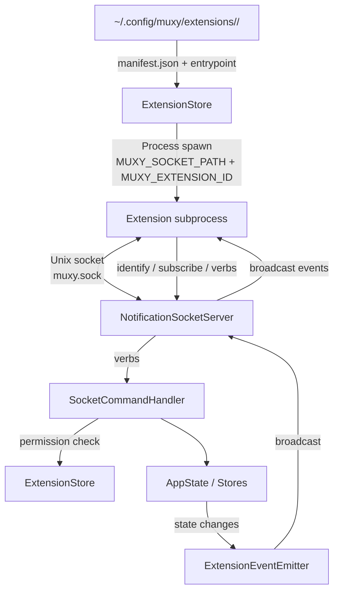

# Extensions Overview

> **Status:** under active development. The manifest format, permission set, and event wire format may change without notice. Marked **DEV** in Settings.

Extensions are user-installed subprocesses that Muxy launches and talks to over the existing notification Unix socket. They can react to workspace events, register palette commands, and (with permission) drive the same verbs the `muxy` CLI exposes.



## Pages

| Page | What's in it |
| --- | --- |
| [Manifest](manifest.md) | `manifest.json` fields, examples |
| [Permissions](permissions.md) | Permission grants and what they unlock |
| [Events](events.md) | Subscribable events, payloads, identify/subscribe handshake |
| [Palette Commands](palette-commands.md) | Declare commands that appear in the command palette |
| [AI Provider Hooks](ai-provider.md) | Route third-party notifications to a custom source |

## Where extensions live

```
~/.config/muxy/extensions/
  <name>/
    manifest.json
    <entrypoint>      # optional executable; only for pushed events
```

`ExtensionStore` scans the directory on app start, validates each manifest, and spawns one subprocess per enabled extension **that declares an entrypoint**. Extensions without one register their UI (commands, topbar, status bar, tabs) and run `runScript` commands with no resident process. Settings → Extensions lists every loaded extension with toggle, permissions, and recent stdout/stderr.

## How extensions talk to Muxy

Extensions use the same Unix socket as the `muxy` CLI, with a small protocol on top: two sticky commands (`identify`, `subscribe`) followed by any of the existing verbs.

```
identify|<extension-id>|<token>  # claim identity; token comes from MUXY_EXTENSION_TOKEN env
subscribe|<event-name>           # receive `event|<name>|key=value...` lines
<verb>|<args>                    # any CLI verb (permission-gated)
```

See [Events](events.md) for the handshake walkthrough and the line format.

## Process & failure model

- One long-lived subprocess per extension that declares an entrypoint. Crashes are surfaced in Settings → Extensions; the extension is marked `stopped` until toggled or the app restarts.
- Stdout and stderr are captured to an in-app rolling log (last 200 lines per extension).
- Stopping Muxy terminates all extension subprocesses.

## Security model

- **Process isolation.** A misbehaving extension can't take down Muxy.
- **Manifest-declared permissions.** Every state-changing verb requires a matching `permissions` entry. The check happens in `SocketCommandHandler`.
- **Subscription allowlist.** An identified extension can only `subscribe` to events declared in its manifest `events` array, or to its own `command.<id>` events.
- **Identify allowlist.** An extension can only `identify` as a name that `ExtensionStore` actually loaded from disk.
- **Not covered.** Peer-process authentication. Any local process that can reach the socket and knows a loaded extension's name can identify as it. Treat the socket as a local-user trust boundary, not a sandbox.

## Reference implementation

The `hello` example used during development is at `~/.config/muxy/extensions/hello/` — a shell script that subscribes to a few events and posts a notification back when its palette command fires.
